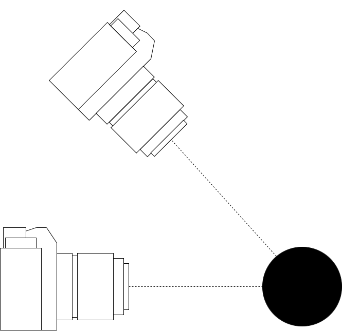
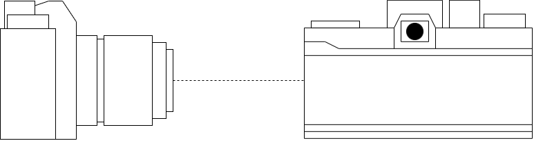
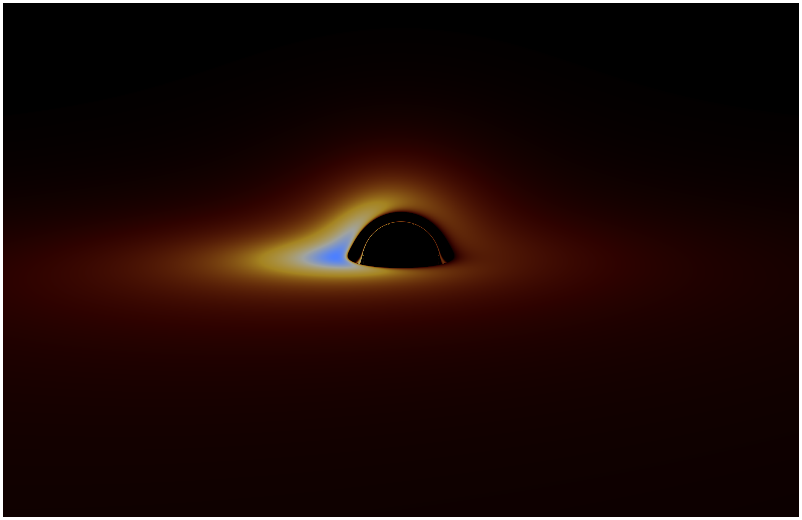

# Numerical Ray Tracing of a Thin Accretion Disk Around a Schwarzschild Black Hole

A Fortran implementation of backwards null geodesic ray tracing in Schwarzschild spacetime,
reproducing the optical appearance of a thin accretion disk in the spirit of Luminet (1979).

This code is released under the **MIT License**. See [`LICENSE`](LICENSE).

---

## Overview

Rays are traced **backwards from a distant observer** using a Hamiltonian formulation of the
null geodesic equations. Where a ray intersects the equatorial accretion disk, the observed
brightness is computed including gravitational redshift and relativistic Doppler effects via
a frequency-shift factor g, with observed luminance scaling as L ∝ I_em × g⁴.

The equations of motion are integrated adaptively using a **Dormand–Prince RK5(4)** stepper
with FSAL reuse.

---

## Key Parameters

These are set in `main.f95`:

| Parameter | Description | Default |
|-----------|-------------|---------|
| `nx`, `ny` | Output resolution (width × height) | 2880 × 1864 |
| `r_obs` | Observer radius in units of M | 150 |
| `fovx_deg` | Horizontal field of view (degrees) | 40 |
| `rtol`, `atol` | Integrator tolerances | 1e-9, 1e-12 |

These are the ones you'll likely tweak first:


- `theta_deg` — camera polar angle (tilt / elevation)


- `phi_deg` — camera azimuth (rotation around the black hole)

---

## Building and Running

### Requirements
- A Fortran compiler supporting Fortran 95 and `iso_fortran_env`
- Tested with **gfortran** on macOS and Linux

### macOS (gfortran via Homebrew)

1. Install gfortran:
```bash
brew install gcc
```

2. Compile:
```bash
gfortran -O2 -o raytrace schwarzschild_physics.f95 camera.f95 disk.f95 DP54.f95 render_shadow.f95 main.f95
```

3. Run:
```bash
./raytrace
```

### Linux (gfortran)

1. Install gfortran:
```bash
sudo apt install gfortran   # Debian/Ubuntu
sudo dnf install gcc-gfortran   # Fedora
```

2. Compile and run as above.

### Windows

The easiest route on Windows is to use **gfortran via MSYS2**.

1. Install [MSYS2](https://www.msys2.org/) and open the **MSYS2 MINGW64** terminal.

2. Install gfortran:
```bash
pacman -S mingw-w64-x86_64-gcc-fortran
```

3. Compile:
```bash
gfortran -O2 -o raytrace schwarzschild_physics.f95 camera.f95 disk.f95 DP54.f95 render_shadow.f95 main.f95
```

4. Run:
```bash
./raytrace
```

### Output

The renderer writes `disk.ppm` (binary P6 PPM) to the working directory.
This can be opened directly in Preview (macOS) or GIMP.

---

## Project Structure

| File | Description |
|------|-------------|
| `main.f95` | Entry point — sets parameters and calls the renderer |
| `render_shadow.f95` | High-level ray tracer and image writer |
| `camera.f95` | Constructs initial null rays at the observer |
| `schwarzschild_physics.f95` | Hamiltonian equations of motion |
| `disk.f95` | Equatorial plane crossing detection and refinement |
| `DP54.f95` | Adaptive Dormand–Prince RK5(4) integrator |
| `Documentation.pdf` | Technical write-up of the physics and implementation |

---

## Example Output




**If you generate multiple images you can stitch them together into a GIF.**


---

## Reference

J.-P. Luminet, *Image of a Spherical Black Hole with Thin Accretion Disk*,
Astronomy and Astrophysics, 75, 228–235 (1979).

---

## Feedback

If you find any inconsistencies or have questions, please feel free to email me at
[your.email@example.com](mailto:your.email@example.com).
