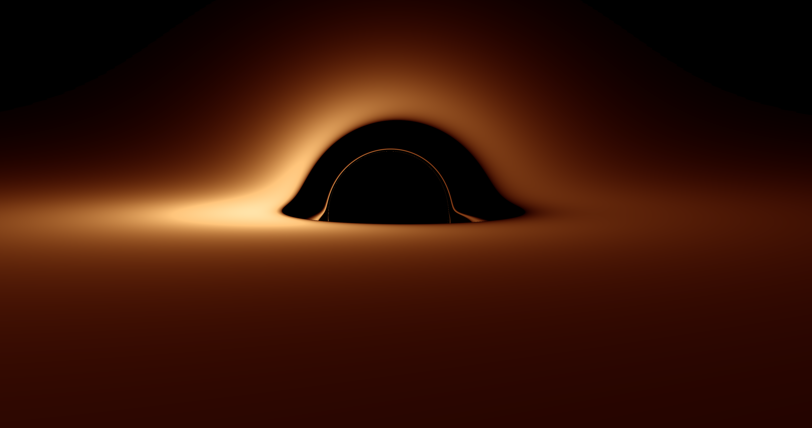
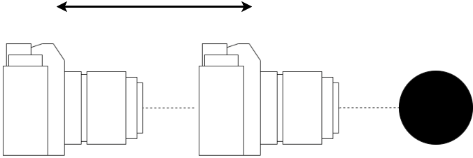
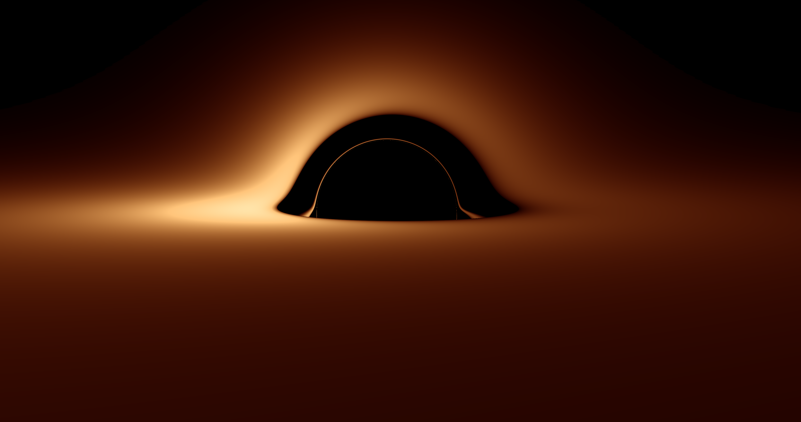
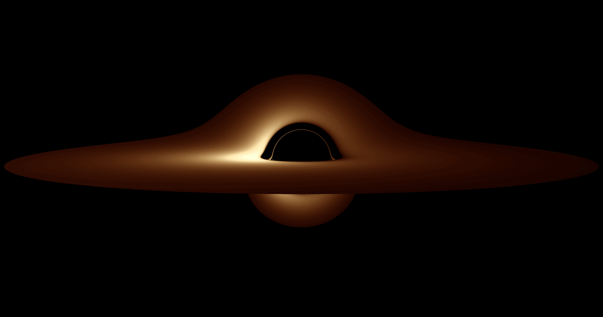
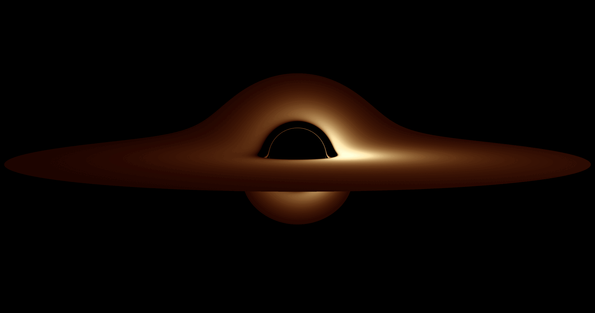

# Kerr-Newman Black Hole Ray Tracer

A Fortran project for generating images of a thin accretion disk around a Kerr-Newman black hole.

This code is released under the **MIT License**. See [`LICENSE`](LICENSE).

## Overview

This code traces light rays through Kerr-Newman spacetime and generates images of an accretion disk as seen by a distant observer.

I have tried to make it robust for producing black hole images, while still leaving room for experimentation. The UI therefore tries to warn rather than forbid: expensive but valid inputs usually trigger a warning, while only a small number of known cases are blocked outright.

---

## Building and Running

### Requirements
- A Fortran compiler supporting Fortran 95 and `iso_fortran_env`
- Tested with **gfortran** on macOS.

### macOS (gfortran via Homebrew)

Compile:
```bash
gfortran -O3 -march=native  -fopenmp -std=f2008 DP54.f95 utils.f95 kerr_newman_physics.f95 colour_emission.f95 camera.f95 disk.f95 Plancks_law.f95 render_shadow.f95 main.f95 -o raytrace
```

**NOTE**: You may need to compile twice, somtimes when downloading the repo from github, it will not compile on the first try and you need to compile it twice.

Run:
```bash
./raytrace
```

### Linux (gfortran)

**Note**: not yet tested on Linux.

Compile and run as above.

### Windows

Compile:
```bash
gfortran -O3 -march=native -fopenmp -std=f2008 DP54.f95 utils.f95 kerr_newman_physics.f95 colour_emission.f95 camera.f95 disk.f95 Plancks_law.f95 render_shadow.f95 main.f95 -o raytrace.exe
```

**NOTE**: You may need to compile twice, somtimes when downloading the repo from github, it will not compile on the first try and you need to compile it twice.

Run:
```bash
./raytrace
```
---

## Getting Started
If you start with the default parameters, you should always get a good initial image.
However, parameters you most likely want to adjustment first are the observer parameters.

**Radius:**



**Theta:**


**Phi:**


**Other things you likely want to experiment with**

**Resolution** This is where you change the resolution of the image.
If you are just testing things out, I recommend choosing a lower resolution than the default.
I recommend doing something like 800 x 600. The highest resolution tried is 15,360 x 8,640.

**Disk orientation** Here you just have two options, "Retrograde" and "Prograde“. Both work fine, but "Prograde" images tend to be darker than the retrograde images.

**Black hole parameters** This is where you set the parameters of the black hole itself. Spin a is the spin of the black hole with 0 being no spin, and 1 being the theoretical maximum. 1 is currently locked in the UI, but this can be changed in the 'utils.f95' file.
Charge Q is the charge of the black hole. Similarly to spin a, 1 is locked in the UI. However, this does not mean that you can go beyond the extremal charge value for a given spin. For example, if you have set spin a = 0.5, the theoretical maximum for Q is 0.866. The simulation is perfectly capable of running this and producing an image. However, do keep in mind these images may not represent reality.

**Temperature scale** This is the temperature gradient of the disk around the black hole. The standard value here is 50,000 K, this is the value I find produces the nicest images, and a noticeable red/blue shift. However, this is entirely down to taste; if you want a more red image, simply lower the temperature, and if you want a more blue image, increase the temperature.

---
## Example Output

**Run-Time** Depending on your hardware this can take a few minutes to run.


**Figure 1**: Kerr black hole with spin a = 0.5 and Q = 0. Observer at r = 80, theta = 85 deg, and FOV = 40 deg. Retrograde disk.


**Figure 2**: Kerr-Newman black hole with spin a = 0.5 and Q = 0.8. Observer at r = 80, theta = 85 deg, and FOV = 40 deg. Retrograde disk.


**GIF 1**: Kerr black hole with varying spin and Q = 0.0. Observer at r = 80, theta = 85 deg, and FOV = 40 deg. Retrograde disk.


**GIF 2**: Kerr black hole with varying spin and Q = 0.0. Observer at r = 80, theta = 85 deg, and FOV = 40 deg. Prograde disk.

---
## Project Structure

| File | Description |
|------|-------------|
| `main.f95` | Entry point — sets parameters and calls the renderer |
| `render_shadow.f95` | High-level ray tracer and image writer |
| `camera.f95` | Constructs initial null rays at the observer |
| `kerr_newman_physics.f95` | Kerr-Newman equations of motion |
| `disk.f95` | Equatorial plane crossing detection and refinement |
| `DP54.f95` | Adaptive Dormand–Prince RK5(4) integrator |
| `Utils.f95` | Utilities for user input |
| `Plancks_law.f95` | Planck's law for blackbody spectra |
| `colour_emission.f95` | Colour and emission |

---

## If you're new to Fortran

If you are more familiar with Python than Fortran, these rough comparisons may help:

- **Subroutines** — like Python functions that perform an action without returning a value directly
- **Functions** — like Python functions that return a value
- **`real`** — like a Python `float`
- **`integer`** — like a Python `int`
- **`logical`** — like a Python `bool`
- **Modules** — like Python modules or namespaces
- **`use`** — like Python `import`
- **`do` loops** — like Python `for` loops
- **`parameter`** — like a constant
- **`implicit none`** — forces variables to be declared explicitly
- **Derived types** — custom data structures; here `settings_type` stores the current render settings in one place

Fortran is case-insensitive, so `implicit none` and `IMPLICIT NONE` mean the same thing. I sometimes use uppercase for readability.

**Conventions**
* The code uses geometric units unless otherwise stated
* M is the black hole mass
* a is the spin parameter
* Q is the charge
* nx and ny are the output image dimensions
* observer_theta and observer_phi set the observer orientation
* temperature_scale sets the overall disk temperature scale

---

## Reference

J.-P. Luminet, *Image of a Spherical Black Hole with Thin Accretion Disk*,
Astronomy and Astrophysics, 75, 228–235 (1979).
https://ui.adsabs.harvard.edu/abs/1979A%26A....75..228L/abstract

---

## Feedback

If you find any inconsistencies or have questions, please feel free to email me at
[lars.rosengren@ou.ac.uk](mailto:lars.rosengren@ou.ac.uk).
