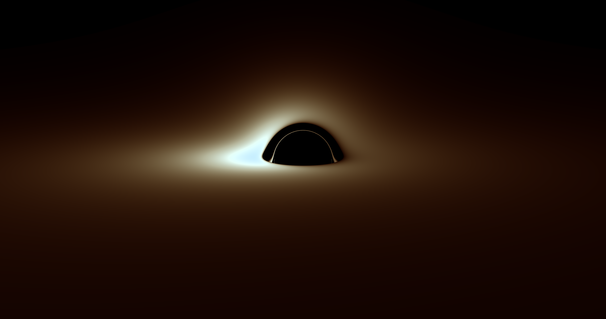
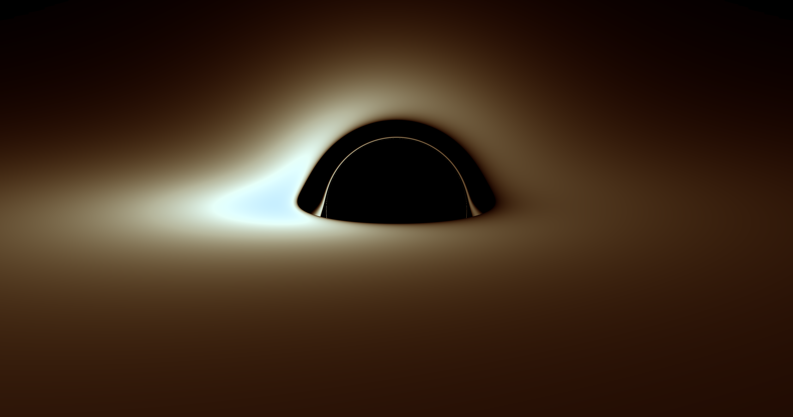
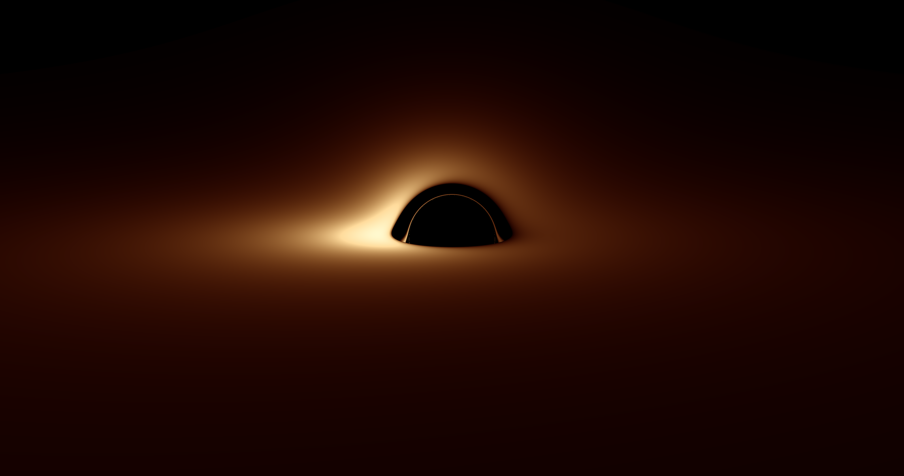
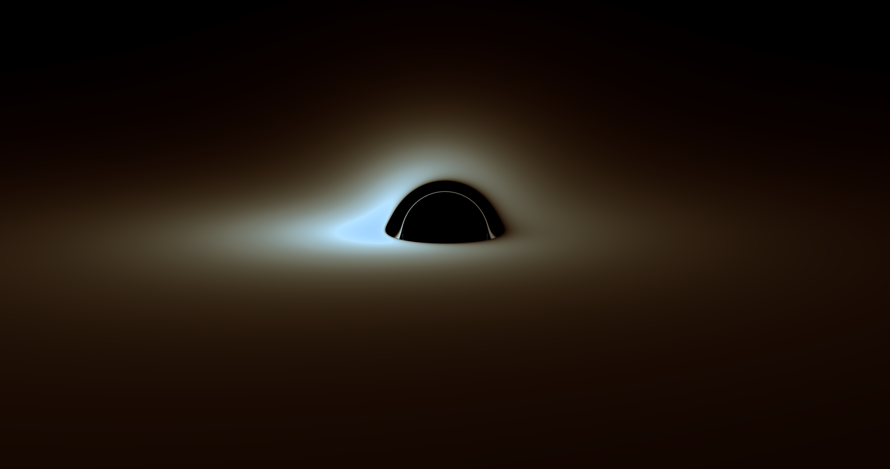

# Numerical Ray Tracing of a Thin Accretion Disk Around a Schwarzschild Black Hole

A Fortran implementation of backwards null geodesic ray tracing in Schwarzschild spacetime,
reproducing the optical appearance of a thin accretion disk in the spirit of Luminet (1979).

This code is released under the **MIT License**. See [`LICENSE`](LICENSE).

---

## Overview

Rays are traced **backwards from a distant observer** using a Hamiltonian formulation of the
null geodesic equations. Where a ray intersects the equatorial accretion disk, the observed
brightness is computed including gravitational redshift and relativistic Doppler effects via
a frequency-shift factor g, with observed luminance scaling as L ∝ I_em × g⁴.

The equations of motion are integrated adaptively using a **Dormand–Prince RK5(4)** stepper
with FSAL reuse.

For a full technical write-up of the physics and implementation, see Documentation.pdf

---

## Key Parameters

The software asks the user to input these variables:

| Parameter | Description | Default |
|-----------|-------------|---------|
| `nx`, `ny` | Output resolution (width × height) | 2880 × 1864 |
| `r_obs` | Observer radius in units of M | 150 |
| `fovx_deg` | Horizontal field of view (degrees) | 40 |
| `T0` | Temperature of Accretion disc | 9000 K |

These are the ones you'll likely tweak first:


- `theta_deg` — camera polar angle (tilt / elevation)


- `phi_deg` — camera azimuth (rotation around the black hole)

These two variables are set in the main.f95 file:
| Parameter | Description | Default |
|-----------|-------------|---------|
| `rtol`, `atol` | Integrator tolerances | 1e-9, 1e-12 |

---

## Building and Running

### Requirements
- A Fortran compiler supporting Fortran 95 and `iso_fortran_env`
- Tested with **gfortran** on macOS.

### macOS (gfortran via Homebrew)

1. Install gfortran:
```bash
brew install gcc
```

2. Compile:
```bash
gfortran -O2 -fopenmp -std=f2008 DP54.f95 schwarzschild_physics.f95 camera.f95 disk.f95 Plancks_law.f95 render_shadow.f95 utils.f95 main.f95 -o raytrace
```

3. Run:
```bash
./raytrace
```

### Linux (gfortran)

**Note**: not yet tested on Linux.

1. Install gfortran:
```bash
sudo apt install gfortran   # Debian/Ubuntu
sudo dnf install gcc-gfortran   # Fedora
```

2. Compile and run as above.

### Windows

The easiest route on Windows is to use **gfortran via MSYS2**.

1. Install [MSYS2](https://www.msys2.org/) and open the **MSYS2 MINGW64** terminal.

2. Install gfortran:
```bash
pacman -S mingw-w64-x86_64-gcc-fortran
```

3. Compile:
```bash
gfortran -O2 -fopenmp -std=f2008 -o raytrace schwarzschild_physics.f95 camera.f95 disk.f95 DP54.f95 Plancks_law.f95 render_shadow.f95 utils.f95 main.f95
```

4. Run:
```bash
./raytrace
```
---

## Alternatively you can use the pre-compiled executables in the executables folder.

### macOS

1. Open the terminal.

2. `cd` into the folder that contains `raytrace` (example for Downloads):
```bash
cd ~/Downloads
```

3. Mark it as executable:
```bash
chmod +x ./raytrace
```
   **Note**: If you skip this step, macOS may treat the file as a regular document and won’t let it run.

4. Run it:

   **Option A**: Double-click `raytrace` in Finder (this may open/run via Terminal depending on your macOS settings).

   **Option B**: (Terminal):
```bash
./raytrace
```

   **Note**: If macOS blocks it because it was downloaded from the internet:
```bash
xattr -d com.apple.quarantine ./raytrace
```

### Windows

Simply double click the `raytrace.exe`
If Windows shows a SmartScreen warning, click **More info** → **Run anyway** (or right-click → **Properties** → **Unblock**, if shown).

### Output

The renderer writes `disk.ppm` (binary P6 PPM) to the working directory.
This can be opened directly in Preview (macOS) or GIMP.

---

## Project Structure

| File | Description |
|------|-------------|
| `main.f95` | Entry point — sets parameters and calls the renderer |
| `render_shadow.f95` | High-level ray tracer and image writer |
| `camera.f95` | Constructs initial null rays at the observer |
| `schwarzschild_physics.f95` | Hamiltonian equations of motion |
| `disk.f95` | Equatorial plane crossing detection and refinement |
| `DP54.f95` | Adaptive Dormand–Prince RK5(4) integrator |
| `Utils.f95` | Utilities for user input |
| `Documentation.pdf` | Technical write-up of the physics and implementation |

---

## Example Output
**Run-Time** Depending on your hardware this can take a few minutes to run. There is currently no progress output to tell you how far the program has gotten (This will be added).
So just give it some time. The highest resolution tried is 15,360 x 8,640.

**Figure 1**: Resolution: 4K, r_obs = 150, Temperature = 9000

**Figure 2**: Resolution: 4K, r_obs = 80, Temperature = 9000

**Figure 2**: Resolution: 4K, r_obs = 150, Temperature = 6000

**Figure 2**: Resolution: 4K, r_obs = 150, Temperature = 12000

**If you generate multiple images you can stitch them together into a GIF.**

**r_obs set to 80**

---

## Reference

J.-P. Luminet, *Image of a Spherical Black Hole with Thin Accretion Disk*,
Astronomy and Astrophysics, 75, 228–235 (1979).
https://ui.adsabs.harvard.edu/abs/1979A%26A....75..228L/abstract

---

## Feedback

If you find any inconsistencies or have questions, please feel free to email me at
[lars.rosengren@ou.ac.uk](mailto:lars.rosengren@ou.ac.uk).
